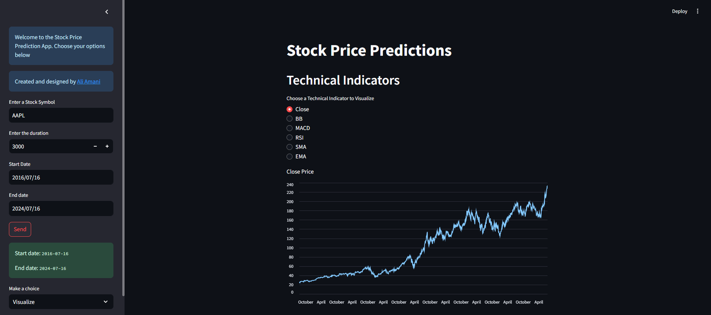

# Stock Price Prediction App

Welcome to the Stock Price Prediction App! This app allows you to visualize stock price data, explore technical indicators, and make short-term price predictions using machine learning models.

## Table of Contents

- [Description](#description)
- [Features](#features)
- [Setup](#setup)
- [Usage](#usage)
- [Technologies](#technologies)
- [Results](#results)
- [License](#license)
- [Feedback](#feedback)
- [Authors](#authors)

## Description

The Stock Price Prediction App is a Streamlit-based web application that provides users with tools to analyze historical stock price data, visualize technical indicators, and make short-term price predictions using different machine learning models.

## Features

- **Visualize Technical Indicators**: Explore various technical indicators such as Bollinger Bands, MACD, RSI, SMA, and EMA to gain insights into stock price trends.

- **Recent Data Display**: View the most recent data of the selected stock, including the last 10 data points.

- **Price Prediction**: Predict future stock prices using machine learning models including Linear Regression, Random Forest Regressor, Extra Trees Regressor, KNeighbors Regressor, and XGBoost Regressor.

## Setup

1. Clone the repository:

   ```sh
   git clone 
   ```

2. Navigate to the project directory:

   ```sh
   cd stock-price-prediction-app
   ```

3. Install the required Python packages using pip:

   ```sh
   pip install -r requirements.txt
   ```

## Usage

1. Run the Streamlit app:

   ```sh
   streamlit run app.py
   ```

2. The app will open in your default web browser. Use the sidebar to choose options for visualization, recent data display, or making price predictions.

3. Follow the on-screen instructions to input the stock symbol, select a date range, and choose technical indicators or prediction models.

## Technologies

- Python
- Streamlit
- pandas
- yfinance
- ta (Technical Analysis Library)
- scikit-learn
- XGBoost

## Results

The app can show the stock predictions for a chosen period with different machine learning algorithms. The algorithms are included here:

- LinearRegression
- RandomForestRegressor
- ExtraTreesRegressor
- KNeighborsRegressor
- XGBoostRegressor

Here you can see the AAPL stock prediction for 3 days ahead using the XGBoost algorithm.


Another option is the visualization by the close price or some indicators. The options are listed below:

- Close
- BB
- MACD
- RSI
- SMA
- EMA

Here we have the AAPL stock visualization using the close price:



The last option is to show the recent data in table format. The figure below shows the recent AAPL data:


## License

This project is under MIT license:

[](https://choosealicense.com/licenses/mit/)

## Feedback

If you have any feedback, please reach out to me at *<aliamani019@gmail.com>*.

## Authors

[@AliAmani](https://github.com/MrAliAmani)
